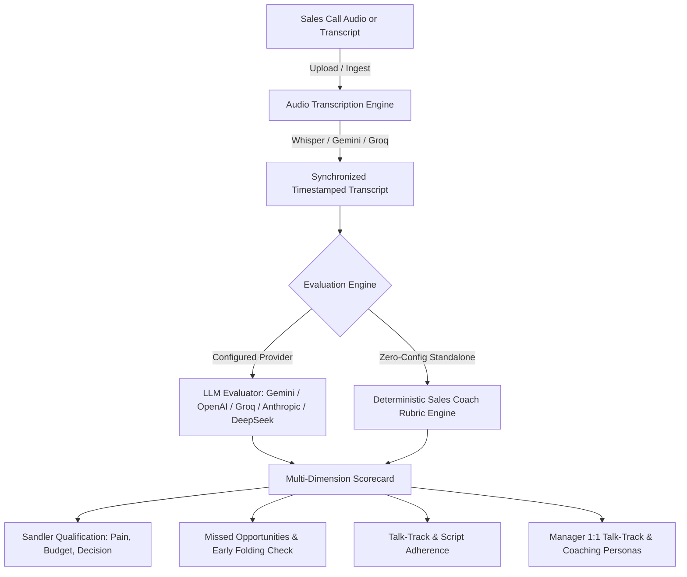

# Sales Coach AI 🎙️🧠

[](LICENSE)
[](https://github.com/Yz613/Sales-Coach/actions)
[](https://nextjs.org/)
[](https://react.dev/)
[](https://www.typescriptlang.org/)
[](https://tailwindcss.com/)

An open-source, AI-powered Sales Coaching & Call Evaluation platform. Analyze sales calls, grade rep performance against customized talk-tracks and qualification rubrics (e.g. Sandler), transcribe audio recordings with synchronized playback, and deliver targeted rep coaching feedback.

**Hosted:** [refreshqueue.com](https://refreshqueue.com) serves the public marketing page at `/`. The signed-in product is at [`/app`](https://refreshqueue.com/app). Self-host from this repo for free (MIT).

---

## Architecture Overview



---

## Highlights

- **⚡ Standalone / Local Mode (Zero-Config):** Run locally out of the box with SQLite. No required external accounts, API keys, or cloud dependencies needed to get started.
- **🎧 Call Audio & Synchronized Transcript:** Upload MP3, WAV, or M4A call recordings with automatic AI transcription and an audio player with synchronized timestamp highlighting.
- **🤖 Multi-Provider LLM Evaluations:** Run call evaluations using your choice of provider:
  - **Google Gemini** (`gemini-2.5-flash`, `gemini-2.5-pro`)
  - **OpenAI** (`gpt-4o`, `gpt-4o-mini`, `o3-mini`)
  - **Groq** (`llama-3.3-70b-versatile`)
  - **Anthropic** (`claude-3-5-sonnet-latest`, `claude-3-5-haiku-latest`)
  - **DeepSeek** (`deepseek-chat`, `deepseek-reasoner`)
  - **OpenRouter** (any model)
  - *Or use the built-in deterministic rubric engine for pasted transcripts with zero API keys.*
- **📋 Deal Stages & Talk-Tracks:** Define customized rubrics, qualification criteria, and talking tracks per pipeline stage.
- **👥 Rep Coaching Personas:** Track individual rep performance, identify repeat struggles vs. strengths, and auto-generate 1:1 manager talk tracks.
- **🔐 Optional Multi-Tenant Auth & RBAC:** Connect [Clerk](https://clerk.com) for team workspaces, organization switching, and Admin vs. Member access control.
- **🐳 Docker Ready:** Includes production-ready `Dockerfile` and `docker-compose.yml`.
- **☁️ Cloudflare Workers Ready:** Preconfigured for edge deployment via OpenNext and Cloudflare D1.

---

## Quickstart

### Option 1: Local Node.js (Fastest)

```bash
# 1. Clone repository
git clone https://github.com/Yz613/Sales-Coach.git
cd Sales-Coach

# 2. Install dependencies
npm install

# 3. One-step automated setup (creates .env.local & seeds database)
npm run setup

# 4. Start development server
npm run dev
```

Open [http://localhost:3000](http://localhost:3000) (redirects to `/app`).

You will immediately be in **Local Admin Mode** with full access to all features: Call Bank, Reps, Coach, Analytics, Scripts, and Settings.

---

### Option 2: Docker Compose

If you have Docker installed, you can start Sales Coach with a single command:

```bash
docker compose up --build
```

Then visit [http://localhost:3000](http://localhost:3000).

---

## Adding Your Own AI API Keys

You can add your API keys either directly in the web UI or via environment variables:

### Option A: In-App UI (Recommended)
1. Go to **Admin → Settings** in the top navigation.
2. Select your AI Provider (Gemini, OpenAI, Groq, Anthropic, DeepSeek, or OpenRouter).
3. Paste your API key and click **Save**.
4. Test your key immediately using the built-in **Test Key** tool.

### Option B: Environment Variables
Create a `.env.local` file from the example template:

```bash
cp .env.example .env.local
```

Add your key(s):

```bash
GEMINI_API_KEY=your_gemini_api_key_here
# or
OPENAI_API_KEY=your_openai_api_key_here
# or
GROQ_API_KEY=your_groq_api_key_here
```

> **Audio Uploads Note:** Transcribing uploaded audio files (MP3/WAV/M4A) uses Gemini, OpenAI (Whisper), or Groq (Whisper). Pasted text transcripts work with any configured provider or with the built-in rule engine.

---

## Setting Up User Authentication (Optional)

By default, Sales Coach runs in **Standalone Mode** without any authentication needed. If you want to host it for a team with user logins, team workspaces, and role-based permissions:

1. Create a free account at [Clerk](https://clerk.com).
2. Create a new application in your Clerk Dashboard.
3. In **Organizations → Settings**, enable Organizations so users can create and join teams.
4. Copy your keys into `.env.local`:

```bash
NEXT_PUBLIC_CLERK_PUBLISHABLE_KEY=pk_test_...
CLERK_SECRET_KEY=sk_test_...
```

5. Restart the development server (`npm run dev`). The app will now enforce authentication:
   - **Admin (`org:admin`):** Full access to settings, scripts, analytics, rep personas, and team invites.
   - **Member (`org:member`):** Scoped access to the Call Bank, call uploads, and call evaluations.

### Email Invites (Optional)
To send teammate invitations via transactional email, add a [Resend](https://resend.com) API key:

```bash
RESEND_API_KEY=re_...
RESEND_FROM_EMAIL="Sales Coach <invites@yourdomain.com>"
```
*(You can also configure this anytime in Admin → Settings.)*

---

## Project Structure

```text
├── src/
│   ├── app/                      # Next.js App Router (pages & API endpoints under /app)
│   │   ├── calls/                # Call Bank & Call Evaluation detail views
│   │   ├── reps/                 # Rep directory, performance trends & 1:1 talk tracks
│   │   ├── coach/                # Coach Builder & System prompt configuration
│   │   ├── admin/                # Analytics, Rubric/Script manager & Settings
│   │   └── api/                  # REST API routes (transcription, scoring, team sync)
│   ├── components/               # React UI components (Glassmorphism + Tailwind)
│   └── lib/
│       ├── ai/                   # Multi-provider LLM callers, JSON extractors, STT
│       ├── db/                   # Drizzle ORM schemas, SQLite / D1 adapters & seeders
│       └── auth.ts               # Local Standalone & Clerk multi-tenant RBAC logic
├── public/                       # Static assets & sample audio recordings
├── scripts/                      # Setup & audio synthesis utilities
├── schema.sql                    # Cloudflare D1 SQL schema
├── wrangler.jsonc                # Cloudflare Workers configuration
└── open-next.config.ts           # OpenNext Cloudflare deployment adapter
```

---

## Scripts & Commands

| Command | Description |
| :--- | :--- |
| `npm run setup` | One-command setup: environment file & database seeding |
| `npm run dev` | Start the local development server |
| `npm run build` | Compile Next.js production build |
| `npm test` | Run the complete automated test suite (22 suites) |
| `npx tsc --noEmit` | Check TypeScript types |
| `npm run db:seed` | Seed SQLite database with sample reps, stages, and calls |
| `npm run preview` | Build and preview on local Cloudflare Worker runtime |
| `npm run deploy` | Deploy to Cloudflare Workers |

---

## Deploying to Cloudflare Workers

Sales Coach is designed to run seamlessly on Cloudflare Workers using OpenNext and Cloudflare D1:

1. **Log in to Cloudflare:**
   ```bash
   npx wrangler login
   ```

2. **Create a D1 database:**
   ```bash
   npx wrangler d1 create sales-coach-db
   ```
   Copy the output `database_id` into `wrangler.jsonc` under `d1_databases[0].database_id`.

3. **Initialize the database schema:**
   ```bash
   npx wrangler d1 execute sales-coach-db --remote --file=./schema.sql
   ```

4. **Set Production Secrets:**
   ```bash
   npx wrangler secret put CLERK_SECRET_KEY
   # Optional:
   npx wrangler secret put GEMINI_API_KEY
   npx wrangler secret put RESEND_API_KEY
   ```

5. **Deploy:**
   ```bash
   npm run deploy
   ```

---

## Community & Contributing

We welcome contributions of all kinds! Please see:
- [Contributing Guide](CONTRIBUTING.md)
- [Code of Conduct](CODE_OF_CONDUCT.md)
- [Security Policy](SECURITY.md)

---

## License

Copyright (c) 2026 Yz613. This project is licensed under the [MIT License](LICENSE). See the `LICENSE` file in the repository root for the full terms.

