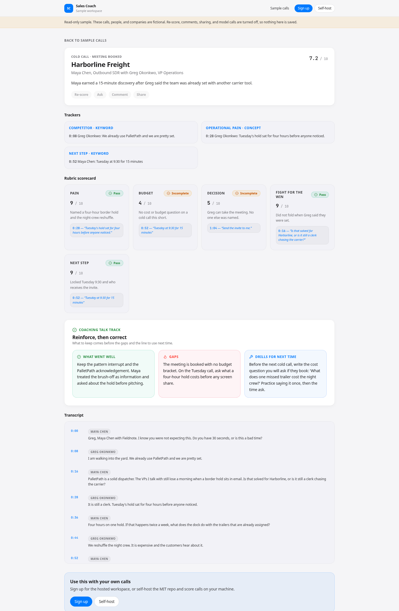
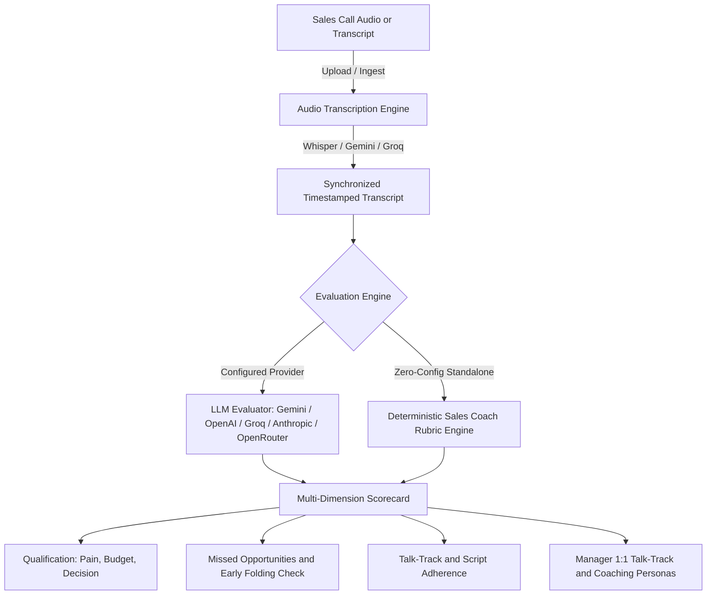

# Sales Coach: the open-source Gong alternative for call coaching and rubrics.

Score a call against your rubric, then coach the rep from the transcript, the scorecard, and the moments that mattered.



**[Try the live demo, no signup](https://refreshqueue.com/demo)**

If this helps, [star the repo](https://github.com/Yz613/Sales-Coach).

## Quickstart

```bash
git clone https://github.com/Yz613/Sales-Coach.git
cd Sales-Coach
npm install
npm run setup
npm run dev
```

Open [http://localhost:3000](http://localhost:3000). Local Next redirects `/` to the marketing page. The product is at [http://localhost:3000/app](http://localhost:3000/app). With no keys configured you are in Local Admin Mode: Call Bank, reps, coach, and settings are available, and pasted transcripts can be graded by the built-in rubric.

## Self-host

```bash
git clone https://github.com/Yz613/Sales-Coach.git
cd Sales-Coach
docker compose up --build
```

Then open [http://localhost:3000/app/calls](http://localhost:3000/app/calls). Step-by-step, including how to score with your own model key, is in [SELF-HOST.md](SELF-HOST.md).

If you do not have Cloudflare credentials, set `CLEF_EVALUATION_MODE=off` so your own model key does the scoring. Compose sets that already. For `npm run dev`, put it in `.env.local`.

## Compared with Gong

|  | Sales Coach | Gong |
| --- | --- | --- |
| Open source, MIT, self-host | Yes | No |
| Rubric scorecards and stage talk-tracks | Yes | Yes |
| Coaching notes and manager 1:1 talk tracks | Yes | Yes |
| Transcript, keyword trackers, and concept trackers | Yes | Yes |
| Call search, clips, and comments | Yes | Yes |
| Deal review and a manager-entered forecast | Yes. No trained prediction. | Yes |
| Live meeting bot | No | Yes |
| Seat license | No seat tax to self-host. Hosted plans are on the site. | Custom quote |
| Zoom import | Coming soon | Yes |

The public landing page includes a cost comparison you can set to your own quote. Gong does not publish list prices. The defaults are a starting point from third-party buyer data, and every field is editable.

Call import covers completed recordings and transcripts from the tools in the [integrations library](https://refreshqueue.com/integrations). Zoom import is coming soon.

## Tech and self-hosting

[](LICENSE)
[](https://github.com/Yz613/Sales-Coach/actions)

See [GitHub Actions reliability](docs/CI_RELIABILITY.md) for failure causes, deployment checks, and local verification.

[](https://nextjs.org/)
[](https://react.dev/)
[](https://www.typescriptlang.org/)
[](https://tailwindcss.com/)


```mermaid
graph TD
    A[Sales Call Audio or Transcript] -->|Upload / Ingest| B[Audio Transcription Engine]
    B -->|Whisper / Gemini / Groq| C[Synchronized Timestamped Transcript]
    C --> D{Evaluation Engine}
    D -->|Configured Provider| E[LLM Evaluator: Gemini / OpenAI / Groq / Anthropic / OpenRouter]
    D -->|Zero-Config Standalone| F[Deterministic Sales Coach Rubric Engine]
    E --> G[Multi-Dimension Scorecard]
    F --> G
    G --> H[Qualification: Pain, Budget, Decision]
    G --> I[Missed Opportunities and Early Folding Check]
    G --> J[Talk-Track and Script Adherence]
    G --> K[Manager 1:1 Talk-Track and Coaching Personas]
```

- Local mode uses SQLite. No account is required to read seeded calls or grade a pasted transcript.
- Upload MP3, WAV, or M4A. Transcription uses Gemini, OpenAI, or Groq. Playback stays aligned with the transcript.
- Model evaluations: Gemini, OpenAI, Groq, Anthropic, or OpenRouter. Or a local OpenAI-compatible server such as Ollama or LM Studio. Or skip keys and use the built-in rubric.
- Deal stages, talk-tracks, rep personas, and manager 1:1 notes.
- Optional team sign-in and roles. Hosted sign-up on refreshqueue.com requires a paid plan before workspace data is shown.
- Docker Compose, and a Cloudflare Workers plus D1 path for the hosted deployment.

### Model keys

In the app: Admin, then Settings, pick a provider, paste the key, Save, then Test Key.

Or copy `.env.example` to `.env.local`:

```bash
GEMINI_API_KEY=your_gemini_api_key_here
# or OPENAI_API_KEY, GROQ_API_KEY, ANTHROPIC_API_KEY, OPENROUTER_API_KEY
CLEF_EVALUATION_MODE=off
```

`CLEF_EVALUATION_MODE=off` is what a self-host without Cloudflare credentials should use. Details are in [SELF-HOST.md](SELF-HOST.md).

### Optional team sign-in

Leave it unset for Local Admin Mode. To add organizations and roles, create an application, enable organizations, and set the publishable and secret keys. Self-hosters who only want access control should set `BILLING_REQUIRED=false`. Hosted billing, invite mail, and production secrets are in [SELF-HOST.md](SELF-HOST.md) and [docs/SECURITY.md](docs/SECURITY.md).

### Project structure

```text
├── src/app/                 # Next.js App Router. Product routes live under /app
├── src/app/demo/            # Public read-only sample workspace. No database writes
├── src/components/          # UI
├── src/lib/ai/              # Model callers, transcription, rubric parsing
├── src/lib/db/              # SQLite and D1
├── src/lib/integrations/    # Call, CRM, calendar, and task connectors
├── public/                  # Static assets, including integration logos
├── schema.sql               # D1 schema
└── wrangler.jsonc           # Workers configuration
```

### Scripts

| Command | Description |
| --- | --- |
| `npm run setup` | Create `.env.local` and seed SQLite |
| `npm run dev` | Local development server |
| `npm run build` | Production Next.js build |
| `npm test` | Unit and integration tests |
| `npm run lint` | Lint |
| `npm run worker` | Integration jobs, sync, and retention |
| `npm run db:seed` | Seed sample reps, stages, and calls |
| `npm run preview` | Build and preview the Workers bundle locally |
| `npm run deploy` | Deploy to Cloudflare Workers |

### Cloudflare Workers

Hosted deploys run from GitHub Actions on push to `main`. Do not deploy a fork by hand unless you mean to publish your own worker.

1. `npx wrangler login`
2. `npx wrangler d1 create sales-coach-db` and put `database_id` in `wrangler.jsonc`
3. `npx wrangler d1 execute sales-coach-db --remote --file=./schema.sql`
4. Set secrets with `npx wrangler secret put` for the Clerk secret, `INTEGRATION_ENCRYPTION_KEY`, `INTEGRATION_CRON_SECRET`, `PUBLIC_APP_URL`, and the Stripe secrets if you bill. Optional: `GEMINI_API_KEY`, `RESEND_API_KEY`.
5. Create private R2 buckets `sales-coach-recordings` and `sales-coach-opennext-cache`.
6. `npm run deploy`

Point the zone apex at this worker. `/` is the marketing page, `/demo` is the read-only sample, `/integrations` is the catalog, `/privacy` is the policy, and the product stays at `/app`.

The public demo does not use a database migration. It is a static fixture served by the app.

Integration setup, the Gong workflow comparison, deal forecasting, and security notes live under [docs/](docs/).

## Community

- [Contributing](CONTRIBUTING.md)
- [Good first issues](docs/good-first-issues.md)
- [Code of Conduct](CODE_OF_CONDUCT.md)
- [Security](SECURITY.md)

## License

Copyright (c) 2026 Yz613. [MIT License](LICENSE).
