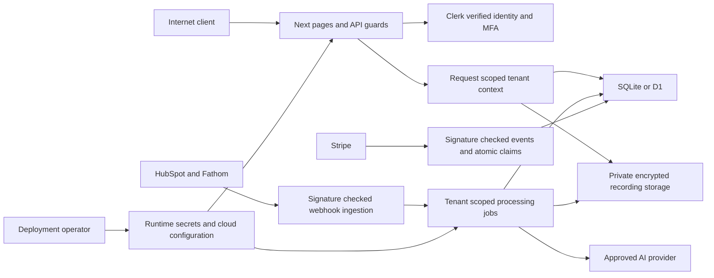

# Sales Coach threat model

## Executive summary

The primary security boundary is between internet clients and sensitive, multi-tenant sales data. This change closes production anonymous-admin fallback, shared tenant context, editable-name call access, middleware-only privileged APIs, public global configuration changes, and unencrypted new credentials/recordings. Residual enterprise risks include identity lifecycle mapping, searchable database plaintext, privileged operator access, vendor access, and infrastructure denial of service. A code change cannot establish complete enterprise security or certification.

## Scope and assumptions

Assumption: production is an internet-facing Next.js application with Clerk organizations; sales conversations, CRM records, coaching notes, vendor credentials, and billing are sensitive. Node deployments use SQLite/private files; Cloudflare uses D1 and private R2. The user authorized implementation with reasonable assumptions, so the analysis proceeded without an additional approval checkpoint.

Scope: application authentication/authorization, tenant context, API and browser boundaries, storage, integration ingestion, jobs, billing claims, error handling, and CI/container configuration. Out of scope: penetration testing vendor infrastructure, actual cloud IAM, TLS certificates, production identity-provider settings, legal/compliance certification, and compromise of the operator's host. Real production credentials were not needed or supplied for verification.

## System model

### Primary components

- Next.js pages and route handlers: `src/app`, wrapped through `src/lib/workspace.ts`.
- Clerk verification and organization roles: `src/lib/auth.ts`, `src/lib/roles.ts`, `src/middleware.ts`.
- Tenant context and scoped Drizzle data access: `src/lib/tenant.ts`, `src/lib/db/service.ts`, revenue services.
- SQLite/D1 and private recordings: `src/lib/db/index.ts`, `src/lib/callAudioStore.ts`.
- HubSpot/Fathom clients and imports: `src/lib/integrations`, `src/lib/revenue/imports.ts`.
- Signed webhooks and scheduler: `src/app/api/webhooks`, `src/app/api/jobs/run/route.ts`, `src/lib/revenue/jobs.ts`.
- Billing provider and purchase claims: `src/lib/stripeCheckout.ts`, `src/lib/stripe.ts`.

### Data flows and trust boundaries

The browser supplies untrusted headers, IDs, names, and bodies. Only verified Clerk identity/membership establishes workspace authority. Jobs use the tenant from an authorized connection or durable job, not client headers. Vendors may supply untrusted transcript content and URLs. A vendor access token authorizes imports, and a separate signature authorizes webhook deliveries. Operator configuration is privileged and must remain outside public application configuration APIs.

## Assets and security objectives

| Asset | Confidentiality | Integrity | Availability |
| --- | --- | --- | --- |
| Recordings and transcripts | Workspace and authorized rep access only | Preserve speaker/content provenance; prevent storage swapping | Playback and review within bounded resource budgets |
| CRM data and deal links | Workspace administrators | Authorized import and review actions | Recoverable sync with durable jobs |
| AI/mail/CRM credentials | Never exposed to browser responses/logs or other tenants | Authenticated encryption binds each stored object | Recoverable encryption key and revocable vendor tokens |
| Private coaching notes | Administrators; excluded from rep-facing AI prompts | Authorized edits only | Reliable access and controlled retention |
| Membership and role | No client-controlled elevation | Verified organization role and MFA | Identity-provider failure denies protected access |
| Billing and quotas | Authorized account scope | Purchase email/organization binding and atomic claim | Provider failures fail safely |
| Audit events | Authorized administrators/operators | App has no public edit/delete interface | Export and protected external retention required |

## Attacker model

An external attacker can send arbitrary HTTP requests, headers, bodies, origins, object IDs, and copied public content. A malicious organization member has a valid session, can change their profile display name, and can upload adversarial transcript text. An administrator can configure authorized integrations and manage workspace data; this broad access is intentional and must be audited. A compromised vendor may supply misleading data. A host/database operator can access raw storage and alter application code; preventing that requires infrastructure controls outside the application trust boundary.

Attackers without provider or server secrets cannot generate a valid Clerk authentication signature, Fathom/Stripe webhook signature, scheduler bearer token, or correctly tagged AES-GCM ciphertext. This assumption depends on secret confidentiality, runtime integrity, and current provider/framework behavior.

## Entry points and attack surfaces

| Surface | Boundary / evidence | Controls |
| --- | --- | --- |
| Workspace pages/APIs | `workspace.ts`, protected exports in `src/app` | Verified server auth, organization, permissions, MFA, tenant scope, dynamic/private responses |
| Call playback/export/search | `viewer-calls.ts`, `call-access.ts`, `revenue/access.ts` | Verified full email ownership and tenant-scoped reads |
| Browser writes/uploads | `security-policy.ts`, upload routes | Origin/Fetch Metadata checks, actual stream limits, file/batch caps |
| Auth frontend proxy | `clerkProxy.ts`, Cloudflare worker | Fixed upstream origin, redirect handling; provider/edge rate controls still needed |
| Fathom/Stripe webhooks | Exact POST routes, vendor verification helpers | Bounded body, signed timestamp tolerance; Fathom jobs deduplicate per recording |
| Scheduler/manual jobs | Jobs routes and `revenue/jobs.ts` | Long constant-time scheduler secret or admin session; atomic leases and bounded batches |
| Checkout claims | `stripeCheckout.ts`, `checkout_claims` | Canonical redirect origin, verified payer email, atomic one-organization claim |
| Secrets/media storage | `setting-secrets.ts`, `revenue/security.ts`, `callAudioStore.ts` | AES-GCM authenticated context and restrictive local permissions |
| CI/container | GitHub workflows, Dockerfile/Compose | Pinned action commits, read-only token permissions, audit/test gates, non-root runtime |

## Top abuse paths

1. Supply internal-looking authentication headers or exploit middleware routing to enter another workspace. Server verification and route guards now reject that authority.
2. Rename a member profile to another rep and fetch the rep's calls or recording. Names and email local parts no longer authorize access.
3. Interleave requests so shared tenant fallback points at another organization. Only asynchronous request/job context now supplies a tenant.
4. Call privileged APIs directly while authenticated as a member. Settings, rep, coaching, invitations, and job routes enforce server admin checks.
5. Replace the global Stripe secret or mutate the Clerk proxy through an anonymous setup endpoint. These endpoints now have no mutation capability and return 410.
6. Trigger processing with cross-site requests, large/chunked bodies, or concurrent requests. Origin checks, limits, and database counters reduce this application-level path.
7. Steal a database backup or move ciphertext between tenants. Credentials and new recordings are encrypted with authenticated identity context; plaintext transcript/CRM data still requires infrastructure encryption and access restrictions.
8. Present someone else's checkout ID, or race two organizations claiming a purchase. Payer email binding and a database uniqueness constraint prevent competing claims.
9. Embed instructions in a transcript to extract private manager notes. Those notes are excluded from the rep-facing model prompt; other model-output manipulation remains possible.
10. Reuse a deprovisioned employee's email or compromise an operator/vendor account. This requires lifecycle controls, immutable identity provisioning, secret revocation, and independent deployment review.

## Threat model table

Priority describes residual risk after this change; pre-change criticality is noted where useful.

| ID | Source / prerequisites | Action and impact | Assets | Current controls | Remaining gap / mitigation | Detection | Likelihood | Severity | Priority |
| --- | --- | --- | --- | --- | --- | --- | --- | --- | --- |
| TM-001 | Internet client; missing production auth or forged headers | Assume privileged identity and access data | All workspace data | Production fails closed; verified Clerk server auth; no x-sc trust | Verify real deployment sessions and canonical origin; preserve route guard coverage | Structured guard denials | Low after change | Critical | Medium; previously critical |
| TM-002 | Concurrent requests; tenant-context failure | Execute a query under another tenant | Calls, CRM, credentials | ALS run scope around entire entry point; no global fallback; explicit job scope | Every new DB entry point must adopt the wrapper; shared DB still uses application isolation | Cross-tenant regressions and external review | Low after change | Critical | Medium; previously critical |
| TM-003 | Valid member; editable name or metadata | Impersonate rep or elevate role | Calls, private notes, settings | Verified email only; organization role only; server admin checks | Email recycling requires lifecycle review and immutable user-to-rep provisioning | API denials; IdP membership events outside app | Low to medium | High | High for identity lifecycle |
| TM-004 | Anonymous public configuration client | Replace payment credentials or alter global authentication | Billing and identity service | Retired endpoints return 410; operator/provider configuration only | Secure operator IAM and secret-manager access | Provider/CI audit logs | Low after change | Critical | Low; previously critical |
| TM-005 | Malicious site or authenticated client | CSRF, large uploads, excessive AI/job work | Data integrity, availability, vendor spend | Origin checks, bounded actual streams, file/batch caps, shared counters, processing leases | Edge connection/anonymous traffic limits; quotas still need operational cost monitoring | 413/429 events, processing outcomes | Medium | High | High for infrastructure availability |
| TM-006 | Stolen storage; privileged operator | Read plaintext records or replace ciphertext | Credentials, recordings, transcripts, CRM | AES-GCM new sensitive blobs; AAD; private bucket/file access; no public recordings | DB content and legacy recordings need storage migration/encryption; key rotation/KMS not implemented | Cloud access logs; AEAD failures | Medium depending hosting | High | High before rollout |
| TM-007 | Captured signed payload or compromised vendor | Replay/import misleading data; cause processing | Imports, jobs, metadata | Timestamp HMAC; fixed origins; deduped Fathom jobs; connection checks | Rotate exposed tokens/secrets; monitor provider scopes and lifecycle; no guarantee of vendor data truth | Import audit and provider logs | Low to medium | Medium | Medium |
| TM-008 | Insider with administrator/database authority | Export sensitive calls or alter logs | Workspace data and audit history | Admin-only export scope; API audit entries; no public audit rewrite | DB operator can alter logs; export to protected logging; enforce employee offboarding | External immutable logging required | Medium | High | High for operator controls |
| TM-009 | Malicious transcript/provider response | Manipulate model output or expose private prompt context | Evaluation integrity and private notes | Private manager notes excluded; outputs rendered as data; no model tools executing arbitrary actions | Model may still produce incorrect coaching; verify important outputs against transcripts | Human review and citations | Medium | Medium | Medium |
| TM-010 | Stolen session or supply-chain weakness | Access data with valid identity or compromised runtime | All app assets | MFA gate with eight-hour factor window; canonical azp; dependency updates/audit; pinned CI actions | MFA enrollment, SSO/SCIM, actual IdP policy, real signed-session tests and pentest remain deployment requirements | IdP alerts and CI gates | Medium | High | High before enterprise rollout |

## Criticality calibration

Critical means unauthenticated or cross-tenant compromise of sensitive customer data or global payment/identity control. High means sensitive disclosure or disruptive abuse by an authenticated member, insider, or infrastructure attacker. Medium means constrained ingestion/model integrity errors or controls needing verification. Low means an abuse path closed by multiple independently enforced controls with limited residual exposure. Prioritization reflects sensitive enterprise conversations, not a demo-only threat model.

## Focus paths for security review

1. `src/lib/auth.ts` — verified session, email verification, role, origin, MFA.
2. `src/lib/workspace.ts` — entry-point guards, request scope, limits, safe responses and audit.
3. `src/lib/tenant.ts` — ALS isolation and failure modes.
4. `src/lib/call-access.ts` and `viewer-calls.ts` — member ownership and rep creation.
5. `src/lib/db/service.ts` — scoped data operations, secret migration, explicit legacy ownership.
6. `src/lib/revenue/security.ts` and `setting-secrets.ts` — key lifecycle and authenticated encryption.
7. `src/lib/callAudioStore.ts` — recording storage, legacy compatibility and path handling.
8. `src/lib/security-policy.ts` and `security-rate-limit.ts` — configuration, origin and resource budgets.
9. `src/lib/stripeCheckout.ts` — canonical redirects, email checks and atomic claims.
10. Webhook/job route handlers and `src/lib/revenue/jobs.ts` — signatures, tenant source, leases, disconnect/deletion races.
11. `src/lib/ai/llm.ts`, `transcribe.ts`, `coach.ts` — credentials in requests, upstream redaction and private prompt content.
12. `src/middleware.ts`, `AuthProvider.tsx`, `next.config.ts` — browser CSP and defense in depth.
13. `.github/workflows`, `Dockerfile`, `docker-compose.yml`, `wrangler.jsonc` — deployment identity and isolation.

## Verification and evidence limits

Security tests exercise real route exports without middleware and use isolated temporary databases, trusted server auth fixtures, concurrent requests, corrupted ciphertext, malformed streams, and competing checkout claims. Existing revenue tests cover cross-tenant records, call access, signed webhooks, job retries, disconnect races, and deletion. Type checking and the Next/OpenNext production build verify compatibility. The dependency audit was reduced from 12 findings to zero known advisories on 2026-10-01.

Valid real Clerk MFA sessions, SAML/SCIM, production D1/R2, actual Docker runtime, cloud policies, backups, and live-browser CSP were not verified against customer accounts. See `docs/SECURITY.md` for rollout prerequisites and residual limitations. Relevant primary guidance: [Next.js data security](https://nextjs.org/docs/app/guides/data-security), [Clerk CSP](https://clerk.com/docs/guides/secure/best-practices/csp-headers), [Clerk session token claims](https://clerk.com/docs/guides/sessions/session-tokens), [Drizzle security advisory](https://github.com/drizzle-team/drizzle-orm/security/advisories/GHSA-gpj5-g38j-94v9).
