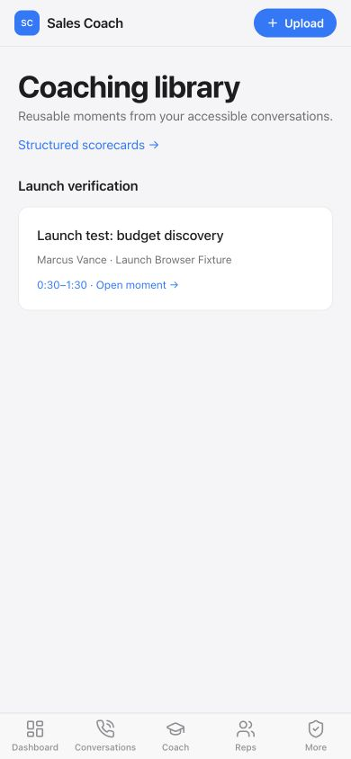

# Monday launch verification

Verified October 9, 2026 for the October 12 launch. Reviewed `main` at `9846654da161d8693e27ae7cf646ddcece3d2e8a`, including the latest stability/security, visitor follow-up, connector, dependency, and deployment changes. This report records pre-release verification. At the time of the audit, the fixes were local and uncommitted; deployment status is tracked separately in the release pull request and GitHub Actions.

## Release assessment

The final local automated checks and production packages pass. Deploy these fixes and complete the live acceptance flows below before launch. At the time of the audit, the hosted version lacked these fixes; successful earlier CI/deployment runs did not validate this working tree.

## Problems reproduced and fixed

| Problem | Result after the fix | Evidence |
| --- | --- | --- |
| Default Clef scoring sent 11 score criteria, exceeding the provider limit; real requests fell back to rules. | Send ten ordered criteria, validate zero-based scores, map them onto the existing 0–10 UI scale. | Real Cloudflare synthetic call returned 13 valid metrics, provider `clef`, no fallback; score mapping and malformed-response regressions pass. |
| CSV import split quoted multiline dialogue at each newline and silently truncated calls. | Parse complete CSV records, escaped quotes, BOM/CRLF, and metadata; derive duration from timestamps. | Twelve-turn CSV persists the entire dialogue as one call with one evaluation credit. |
| Batch size/quota checks did not consistently count all calls across CSV files before processing. | Validate the complete batch and quota before rep creation or audio transcription; reject invalid request shapes. | Aggregate call cap, long-duration quota, invalid fields, and no-write-on-preflight-failure regressions pass. |
| JSON batch rep IDs could reference another workspace. | Resolve admin rep IDs within the active tenant and force members onto their own rep identity. | Foreign-tenant and member-assignment regressions pass. |
| A single-upload evaluation failure left the call indefinitely analyzing. | Mark failed calls retryable; conditional cleanup cannot overwrite a completed review. | Simulated evaluation write failure, retry, partial batch completion, and late-cleanup tests pass. |
| Failed reanalysis could delete the prior scorecard before the replacement was saved. | Replace evaluations atomically in SQLite and Cloudflare D1, scoped by tenant. | Failed-write preservation, successful replacement, 24 concurrent D1 replacements, and foreign-tenant preservation pass. |
| Hosted apex rewrites caused the server and browser to render different navigation, producing a React hydration error. | Preserve the server route for the initial browser render and retain CSP nonces. | Reproduced through a local apex rewrite; corrected page has no hydration errors; shell regression tests pass. |
| Rule fallback could invent objection dialogue and present it as call evidence. | Only create missed-opportunity quotes when matching transcript turns exist; remove the fabricated default exchange and unsupported summary for calls without a confirmed surrender. | No-objection, email-as-business-process, and actual-email-objection regressions pass; browser reanalysis removes the invented exchange. |

Clef request limits were checked against the [official model schema](https://developers.cloudflare.com/workers-ai/models/clef/).

## Completed verification

| Check | Result |
| --- | --- |
| Fresh dependency installation, Node 22 | Pass |
| Fresh dependency installation in isolated copy, Node 20 | Pass; current Cloudflare tooling advertises Node 22 requirements, so deploy with Node 22 |
| Full `npm test`, Node 22.21.0 | Pass: 321 named tests, zero failures, plus the assertion-based script suites |
| Full `npm test`, Node 20.20.2 | Pass: 321 named tests, zero failures, plus the assertion-based script suites |
| TypeScript, both runtimes | Pass |
| Next production build, both runtimes | Pass |
| OpenNext Cloudflare production package, Node 22 | Pass |
| Production dependency advisory gate | Pass: zero moderate, high, or critical advisories |
| Diff whitespace validation | Pass |
| Real Cloudflare Clef synthetic evaluation | Pass: 13 metrics, all valid, no fallback |
| Hosted first-party Clerk login JavaScript bundles | Pass: both bundles and redirects verified |
| Hosted public/protected-route smoke checks | Pass for expected status, redirects, anonymous authorization, and private no-store responses |

Added upload, reanalysis, evidence, and hydration regressions and enabled the previously omitted Clerk-session tests in the normal test command. Native Workers/D1 tests now exercise atomic evaluation replacement as well as credential encryption.

Browser checks used an isolated temporary SQLite database and synthetic conversations. Verified pasted upload, call detail, full review, comment creation, clip creation/library navigation, action-item creation, manager review/correction, refresh persistence, reviewed-call search, reanalysis, and JSON/VTT/SRT exports. Fourteen product pages and nine read endpoints returned successful responses in local smoke checks. The clip library was also visually checked at phone width; the marketing rewrite was checked at desktop width.

Hosted read-only checks covered landing/pricing, integrations, privacy, sign-in, payment-first signup redirect, session recovery, anonymous role, protected APIs, and invalid checkout plans. The existing main CI and deployment runs were successful:

- [Main CI](https://github.com/Yz613/Sales-Coach/actions/runs/37816158540)
- [Hosted deployment](https://github.com/Yz613/Sales-Coach/actions/runs/37648170745)

## Live acceptance still required

1. Deploy this working tree through the normal release process, then repeat the deployed health, login-asset, and browser smoke checks. The audit itself did not commit, push, deploy, or mutate production customer data.
2. Complete a real hosted checkout and payment-first account enrollment, confirm the Stripe webhook unlocks the correct organization, and test sign-out/sign-in plus tenant switching with admin/member accounts. Payment and signup logic have automated coverage, but an actual purchase and enrolled session were not exercised here.
3. Complete an import through each connector promised for launch using a real provider account, then verify recording playback, tenant ownership, duplicate delivery handling, and any enabled CRM/team export. Mocked provider tests passed; live OAuth grants, provider recordings, outbound messages, and exports were not sent.
4. Verify the existing MFA exception in `docs/SECURITY.md`: the hosted Clerk environment previously lacked second-factor strategies and uses `REQUIRE_MFA=false`. Enable enrollment and verify a real MFA session before enforcing that policy. This configuration was not weakened or changed in this review.
5. Check the remaining phone/browser combinations on real devices. This pass exercised the in-app browser and a phone-width clip-library view, not a cross-browser/device matrix.

The authenticated deployed D1 health probe could not be run because no scheduler credential was available in the local test configuration. The deployment workflow includes this probe. `npm run lint` is also currently unconfigured and opens Next's interactive ESLint setup; it was not counted as a passing check. Neither limitation is hidden by the build/test results.

Test databases, audio, and keys were isolated under temporary paths; customer workspace data was not used for mutation tests.
